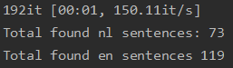
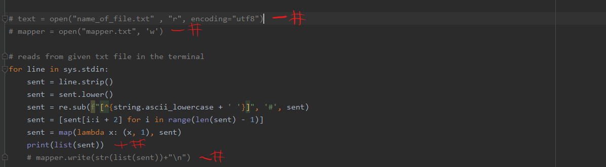
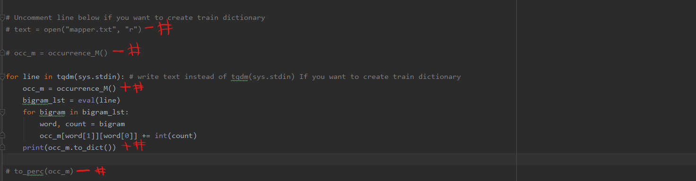
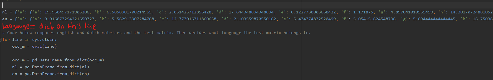

# Dip_2
Classifies whether sentences are written in English or in Dutch

## Installments
Download or clone this git to your computer.

```sh
pip install -r requirements.txt
```
## How to run the code
After you have installed the requirements. You can run the code below in the folder/path (you have downloaded/cloned your git) in the terminal.


Ex. 
```sh
C:\Users\gsvpk\PycharmProjects\dip_2>
```

To run a txt file you want to classify in windows ->

Now our file is called "zinnen_test.txt". But you can put every txt file in there with lines of Dutch and English sentences.
```sh
type zinnen_test.txt | hadopy --mapper "python mapper.py" --reducer "python reducer.py" | hadopy --mapper "python mapper2.py" --reducer "python reducer2.
py"
```

Your output should look something like this:


## Explanation of code
### mapper.py
1. Reads from the given file from the terminal
2. Loops through every line of the file
3. Removes all of the leading and trailing whitespaces of a line using regex
4. Transforms all letter to lowercase letters
5. Changes every character that isn't a space or a-z into a #
6. Gets every bigram in the sentence "bigram" -> bi, ig, gr, ra, am and puts it in a list
7. Use a mapper to map every bigram [(bi, 1), (ig, 1), etc.]
8. prints the mapper as a list

### reducer.py
1. Reads print from mapper.py
2. Loops through every line of the print
3. Creates a 28x28 dictionary matrix
4. Turns line(string) to a list
5. Loops through the list to get every mapped bigram
6. Adds every bigram possibility to the matrix of step 3
7. After the loop the edited matrix is printed as a dictionary

### mapper2.py
1. Reads print from reducer.py
2. Loops through every line of the print
3. Turns line(string) to a dictionary
4. Transforms the already given English and Dutch matrices into a pandas Dataframe
5. Transforms step 3 into a pandas Dataframe
6. Calculates the difference with the sentence Dataframe with the Dutch and English Dataframe
7. Looks what difference is the lowest and with what language is the lowest
8. prints the language with the lowest difference with the sentence and puts a 1 behind it

### reducer2.py
1. Reads print from mapper2.py
2. Loops through every line of the print
3. Unpacks the language and the count
4. Looks what language is printed
5. Adds 1 to the <language>_score
6. Prints the total found sentences for Dutch and English

## For developers
If you want to create your own languages inside comment and uncomment these lines in these files:

### mapper.py


### reducer.py


Run in the folder/path in terminal:
```sh
type your_own_language_file_name.txt | hadopy --mapper "python mapper.py" --reducer "python reducer.py"
```
"your_own_language_file_name.txt" should be file containing plain utf8 text in your chosen language

The output of this print should be a trained dictionary matrix in percentages for a language

That dictionary can be copied and should be added to mapper2.py
```python3
language_name = "here comes the dictionary from the print all on this line"
```
### mapper2.py


```python3
for line in sys.stdin:
    occ_m = eval(line)

    occ_m = pd.DataFrame.from_dict(occ_m)
    nl = pd.DataFrame.from_dict(nl)
    en = pd.DataFrame.from_dict(en)
    your_language = pd.DataFrame.from_dict(Language)

    nl_diff = abs(nl - occ_m).values.sum()
    en_diff = abs(en - occ_m).values.sum()
    your_language_diff = abs(your_language - occ_m).values.sum()

    if nl_diff > en_diff:
        print('%s\t%s' % ('en', 1))
    else:
        print('%s\t%s' % ('nl', 1))
```

To make it a challenge figure out how to edit the if/else part to make it work for you.

Don't forget to change reducer2.py too with the if and else to count the sentences in your chosen language

After you have all the steps above. You can redo the commenting and keep the added code you added yourself (created dictionary of your own language). You can run this code in the folder of dip_2

```sh
type your_own_language_testfile_name.txt | hadopy --mapper "python mapper.py" --reducer "python reducer.py" | hadopy --mapper "python mapper2.py" --reducer "python reducer2.
py"
```
Now you have added your own language and you can see how many sentences it has classified if everything was changed correctly.
## Author
Guy Veenhof
